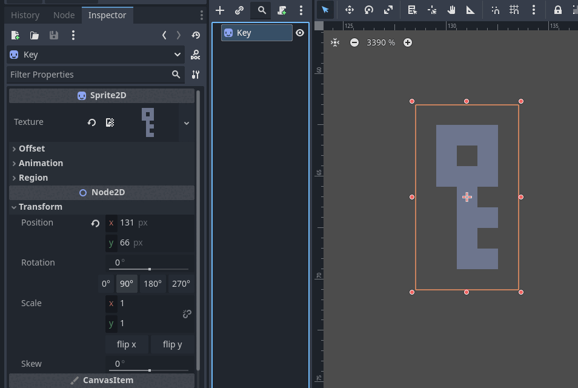

# Snap Rotate
### A Godot plugin to make rotating to fixed values easy



Snap Rotate adds a panel of buttons below the Rotation slider in the inspector, making it easy to click and rotate to a specified degree.

The degrees can also be customized, simply edit the array on line 6 of `addons/snap_rotate/rotate_panel.gd`

```gdscript
var rotation_values:Array[int] = [0, 90, 180, 270]
```
